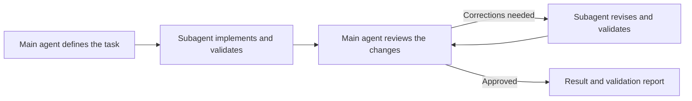

# Sage

A pragmatic, evidence-driven instruction layer for Codex.

This repository contains my personal Codex setup: model instructions, reusable
skills, and an agent definition for a delegate-and-review workflow.

I'm a software engineer working on networking software. I need evidence-backed
decisions, focused changes, and meaningful validation from a coding agent.

The goal is to automate more of the work while maintaining high engineering
standards.

## Why?

This setup is an experiment in shaping a coding agent's behavior through
instructions, skills, and lightweight orchestration rather than application
code. The central question is: can a relatively small instruction layer plus
lightweight delegation and review produce a more reliable coding workflow than
a single general-purpose agent? That is a question this setup explores, not a
proven result.

The philosophy is simple:

- Prefer evidence over assumptions, and make uncertainty explicit.
- Investigate unfamiliar code before modifying it.
- Keep changes small, scoped, and reversible where possible.
- Use skills for repeatable workflows.
- Delegate code implementation with clear scope and acceptance criteria.
- Review the result against the original task and validate before calling it done.

## Status

This is an evolving personal setup, not a polished framework. I use it for
day-to-day development and change the instructions and skills as I learn what
works and what does not.

The delegate-review workflow is the main experiment. I have not conducted a
controlled evaluation against unmodified Codex. Observations about quality,
speed, and cost efficiency are based on personal experience, not measured
benchmarks.

## Model instructions

Sage's [model instructions](model-instructions/sage.md) are a lightweight core
of guidance shared by the main agent and subagents. They
define how agents investigate code, make uncertainty explicit, choose workflows,
preserve unrelated changes, and communicate validation results and remaining
risks.

The skills below turn that philosophy into concrete workflows for slicing
plans, delegating implementation, and reviewing the results. Those workflow
instructions live in separate skill files rather than in the core instructions.

The model instructions started as a trimmed-down adaptation of Codex model
instructions. I kept the guidance relevant to my engineering
workflow, removed what I didn't need, and added a delegate-review workflow for
code changes. The small core is a design choice, not evidence of better results
or lower total context usage.

The borrowed Codex material is licensed under
[Apache-2.0](LICENSE). See [NOTICE](NOTICE) for the source and
modification details.

You can read, borrow, or adapt these workflows without running the installer.

## Core workflows

### Delegate, then review: `delegate-review`

[The delegate-review skill](skills/delegate-review/SKILL.md) started as an
experiment in improving cost efficiency and speed without compromising code
quality. I use a more capable model for planning, orchestration, and review,
while a cheaper, faster model implements bounded changes in a separate
subagent.

The implementation subagent uses `gpt-5.6-luna` with medium reasoning effort.
This works well for the bounded tasks I give it, with the main agent
responsible for planning and reviewing the changes.

The responsibilities are deliberately separate:

1. **The main agent defines the task.** It gives a fresh subagent a
   self-contained task with the scope, constraints, and acceptance criteria.
   The subagent does not inherit the main agent's conversation history.
2. **The subagent implements and validates.** It edits the code and reports the
   changed files, rationale, validation results, and remaining gaps.
3. **The main agent reviews the actual changes.** It checks correctness, tests,
   documentation, and consistency with the codebase, including unnecessary
   complexity and duplicated helpers.
4. **The subagent addresses feedback.** The main agent sends specific
   corrections back to the same subagent rather than fixing the implementation
   itself. The subagent revises the change and validates again, then the main
   agent reviews the result. This repeats until approved.



In my experience, separating implementation from review has noticeably improved
the results. The main agent evaluates the code against the original task,
rather than treating the subagent's completion report as proof that it is done.

`delegate-review` returns the approved change, validation results, and remaining
risks without committing. Documentation-only changes, review-only requests,
and investigations that need no code change do not require this loop.

### `to-work-items`

[The to-work-items skill](skills/to-work-items/SKILL.md) turns a plan into thin
vertical slices: bounded changes with a coherent outcome that can be
implemented, reviewed, and validated independently.

In my experience, coding agents often tackle a large plan in one pass, working
file by file. This skill instead organizes the work around outcomes, producing
smaller, more reviewable changes with explicit acceptance criteria and
validation. A slice can span several files or technical layers. Small,
cohesive tasks stay intact rather than being split artificially.

It returns ordered work items without starting implementation.

### `delegate-work-items`

[The delegate-work-items skill](skills/delegate-work-items/SKILL.md) takes a
plan, splits it into work items (thin vertical slices), then executes each item
through `delegate-review`. For each work item, once review succeeds, it commits
the changes and moves to the next item.

## Supporting skills

### `commit`

I added this skill because Codex's commit messages often needed correction:
vague summaries, claims about changes that weren't made, unnecessary
descriptions of what wasn't done, and inconsistent formatting.

[The commit skill](skills/commit/SKILL.md) requires reading the staged diff or
exact commit diff before writing the message. It describes the actual scope,
intent, and outcome of the change, with a subject of at most 50 characters and
body lines of at most 72 characters.

The goal is useful history for humans: someone reading the commit should
understand what changed and why without reconstructing the agent's
conversation.

### `doc-write`

I added this skill because generated documentation often drifted out of sync
with the codebase, lacked a clear structure, and used unexplained acronyms.

[The doc-write skill](skills/doc-write/SKILL.md) requires checking claims
against the implementation, tests, and repository conventions. It establishes
the audience and purpose, leads with the main point, uses headings to organize
detail, and defines acronyms on first use. It also validates relevant commands,
links, and examples.

The goal is documentation that is accurate, clearly organized, and
understandable without the agent's conversation history.

## Repository layout

| Path | Purpose |
| --- | --- |
| [`model-instructions/sage.md`](model-instructions/sage.md) | Core operating instructions shared by the main agent and subagents |
| [`skills/`](skills/) | Reusable workflows, each described by a `SKILL.md` file |
| [`agents/`](agents/) | The `delegate-worker` agent definition |
| [`setup.sh`](setup.sh) | Installs or uninstalls the setup in `~/.codex` |
| [`git-hooks/`](git-hooks/README.md) | Optional Git hooks and setup instructions |

## Install

To install the full Sage setup, including activating its base model
instructions in Codex, run from the repository root:

```bash
./setup.sh install --activate
```

To install Sage's files without activating its base model instructions, run:

```bash
./setup.sh install
```

The script copies skills to `~/.codex/skills/`, agent definitions to
`~/.codex/agents/`, and model instructions to `~/.codex/model-instructions/`.
You can move or delete the checkout afterward. Keep a checkout available to
run updates or uninstall.

### Development install

To work on Sage itself, use symlinks instead of copies for skills and model
instructions:

```bash
./setup.sh install --dev --activate
```

Keep the checkout at its installed location. Changes to linked files take
effect through the links. Agent definitions are still copied, so rerun the
command after changing them. Uninstall before switching between copy and
development modes.

### Update

Rerun the install command for your chosen mode to update installed files.
Updates stop if an installed destination has been modified or an existing
destination is not owned by Sage. Back up or move conflicting destinations
before retrying.

Do not delete `~/.codex/sage/manifest` while Sage is installed.

### Uninstall

From a Sage checkout, run:

```bash
./setup.sh uninstall
```

Uninstall removes unchanged installed files and links, but preserves modified
ones, including whole modified skill directories. Resolve any retained items
and retry uninstall.

If the config still selects Sage, uninstall restores the previous model setting
or removes it if none existed. If restoration fails, fix the config and retry.

## License

Sage is licensed under the [Apache License 2.0](LICENSE).
Copyright 2026 Ruan de Clercq. See [NOTICE](NOTICE) for OpenAI Codex attribution
and modification details.
